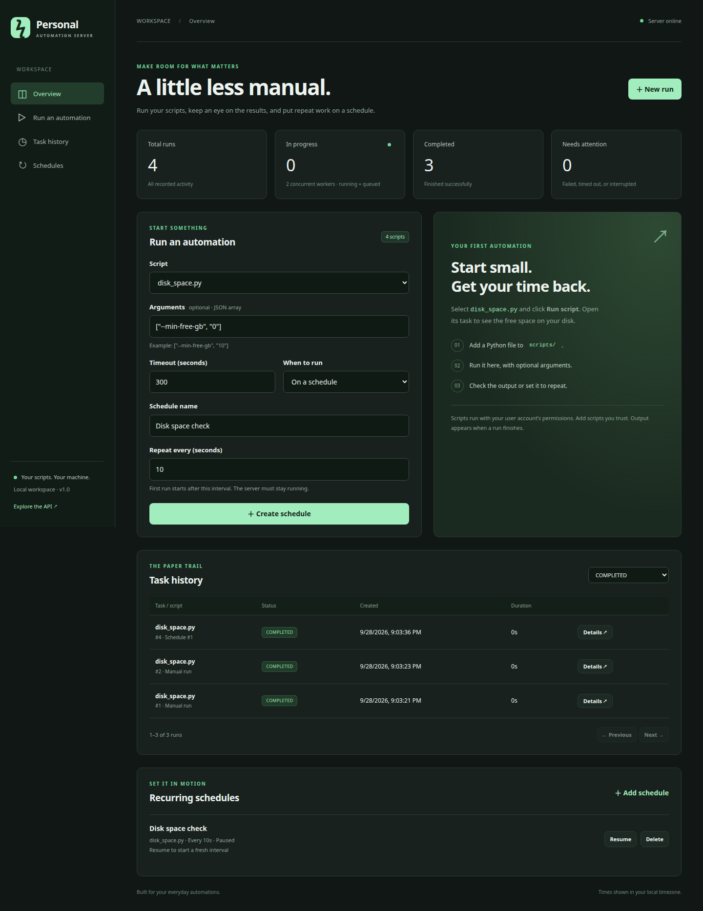

# Your first personal automations

This guide takes you from starting the server to creating a script, scheduling it, and inspecting its results.



## 1. Start the server

Open a terminal in the project folder. If you have not installed dependencies yet, follow the [README setup](../README.md#start-here).

Linux/macOS:

```bash
source .venv/bin/activate
python -m backend.app
```

Windows PowerShell:

```powershell
.\.venv\Scripts\python.exe -m backend.app
```

Leave that terminal open and visit **http://127.0.0.1:8000**. The top-right indicator should say **Server online**. The dashboard refreshes every two seconds while its browser tab is visible.

You do not need Node.js, Docker, or an external database. The server creates `automation.db` in the project folder on its first start.

## 2. Use the included Windows automations

Choose a script in **Run an automation**, enter the arguments below, leave **When to run** as **Right now**, and click **Run script**. Open task details to see its result. Arguments are a JSON array; forward slashes make Windows paths easier to enter without escaping backslashes.

### Check disk space

Select `disk_space.py`. With `[]`, it checks the drive containing your home folder and reports failure if fewer than 10 GiB are free. To check the C: drive explicitly:

```json
["--path", "C:/", "--min-free-gb", "10"]
```

The output lists total, used, and free space. `FAILED` with a low-space message means the threshold was crossed; the script does not delete anything. You can schedule this hourly. The result is stored in task history; it does not send an email or notification.

### Back up a folder

Select `backup_folder.py` and replace the example username with yours:

```json
["--source", "C:/Users/YourName/Documents"]
```

A dated ZIP appears in `AutomationBackups` inside the account's home folder. The task output gives the exact path. Choose another backup location with:

```json
["--source", "C:/Users/YourName/Documents", "--destination", "D:/Backups"]
```

The destination must be outside the source folder. Each run creates a new archive; original files stay in place. Links/junctions are skipped. Use the actual path if Documents is redirected into OneDrive. For a large folder, raise the timeout. Close files you need a consistent copy of before backup; this is a file copy, not a Windows snapshot. A cancelled or timed-out backup can leave a `.zip.partial` file; it is not a completed backup and may be removed after the task stops. Old backups are kept until you delete them.

### Organize Downloads

Select `organize_downloads.py` with `[]` for a **preview**. It lists planned moves into Documents, Images, Videos, Audio, Archives, Installers, and Other subfolders. To perform the moves:

```json
["--apply"]
```

For a custom or redirected Downloads folder:

```json
["--folder", "C:/Users/YourName/Downloads", "--apply"]
```

The organizer processes only files directly in that folder. It skips links, hidden dot-files, partial-download extensions, files modified within the last 60 seconds, and destinations that already exist. Existing folders are not reorganized. Close downloads and programs using those files before applying. Moves copy a file before removing its original, so some free disk space is needed. A forced cancellation during a copy can leave both the original and an incomplete destination; inspect those files before another run. There is no automatic undo—move files back manually if needed.

For a schedule, first check the preview, then create a recurring run with `["--apply"]`. A schedule using `[]` continues to preview only.

### Open your daily websites

Select `open_websites.py` and enter your complete website URLs:

```json
["https://example.com", "https://www.wikipedia.org"]
```

The script asks the default browser to open each URL in a tab. It accepts HTTP and HTTPS addresses. Tabs open on the **server computer**, not a phone or another device viewing the dashboard. Start the server in your signed-in Windows desktop session for this automation; a background service may not have access to the desktop. A successful run means the browser accepted the request, not that every page finished loading. Repeated scheduled runs can open duplicate tabs, so this is usually best run manually.

The old `test.py`, `test_subprocess.py`, and `system_report.py` demos have been removed. Delete any recurring schedules that still refer to them; existing task history remains available.

## 3. Add your own script

Create `scripts/hello.py` with this content:

```python
import argparse
from datetime import datetime, timezone

parser = argparse.ArgumentParser()
parser.add_argument("--name", default="friend")
args = parser.parse_args()

print(f"Hello, {args.name}!")
print("Finished at", datetime.now(timezone.utc).isoformat())
```

Save the file. Within a few seconds, `hello.py` appears in the Script dropdown without restarting the server. Select it and enter:

```json
["--name", "Brega"]
```

Click **Run script**. The result should include `Hello, Brega!`.

Each array item is one command-line argument. A value containing spaces stays one argument. Do not paste shell commands into the field. The server passes arguments directly to Python and does not interpret shell operators.

Script rules:

- Use a regular `.py` file directly inside `scripts/`. Nested paths and symlinks are rejected.
- Scripts run with the same Python interpreter and installed packages as the server. Install any extra packages into `.venv`.
- The working directory is `scripts/`. Use explicit paths or `Path(__file__).resolve().parent` when reading/writing files.
- Scripts must run unattended: standard input is closed, so `input()` will not work.
- Print normal results to stdout, errors to stderr, and exit with a nonzero code to report failure.
- Keep scripts finite. Long-running daemons and detached subprocesses are unsupported.
- Avoid printing credentials; captured output and arguments are stored in the database.

Only add programs you trust. They have your account's filesystem and network permissions. Removing the server token from the child environment is a convenience, not isolation from other credentials accessible to your user.

## 4. Automate a recurring task

Use the same run form:

1. Select `disk_space.py`.
2. Set arguments to `["--min-free-gb", "10"]`.
3. Choose **On a schedule**.
4. Enter a name, such as `Disk space check`.
5. Enter an interval of **60** seconds.
6. Click **Create schedule**.

The schedule appears under **Recurring schedules**. Its first run happens after 60 seconds. Each task is linked to its schedule ID in task history.

Use **Pause** to stop future dispatches. **Resume** starts a fresh interval. **Delete** removes the schedule but keeps its task history. Pausing or deleting a schedule does not cancel a task already submitted; open that task and cancel it separately.

Intervals have a 10-second minimum. Scheduling uses UTC internally; the dashboard displays dates in your browser's timezone. These are repeat intervals, not cron expressions or fixed wall-clock times. For a different interval or arguments, delete and recreate the schedule.

A schedule never overlaps its own active task. If the queue is full, dispatch waits for capacity. If a script disappears, the schedule displays an error and retries after another interval. After downtime, an overdue schedule runs once; missed intervals are not replayed. Scripts should tolerate retries because dispatch is not an exactly-once transaction across a process crash.

**Leave the server running** for schedules to execute. A closed terminal, suspended laptop, or powered-off computer cannot run jobs.

## 5. Understand task results

| Status | Meaning | Next action |
| --- | --- | --- |
| `PENDING` | Accepted and waiting for a worker | Wait, or request cancellation |
| `RUNNING` | Python process is active | Wait, or cancel |
| `COMPLETED` | Script exited with code 0 | Review output if needed |
| `FAILED` | Nonzero exit code or execution error | Read stderr, fix the script, rerun |
| `TIMED_OUT` | Run exceeded its configured timeout | Inspect side effects before retrying |
| `CANCELLED` | Cancellation or graceful shutdown stopped the run | Rerun when appropriate |
| `INTERRUPTED` | Previous server stopped without finalizing the task | Check for orphan processes and side effects before rerunning |

Use the status filter in **Task history** to find failures. Open **Details** to inspect arguments, timing, exit code, stdout, and stderr. **Run again** creates a separate task using the same script filename, arguments, and timeout; it executes the current version of the script.

Cancellation is a request, so a task can finish just before cancellation is processed. A cancelled queued task may stay `PENDING` until a worker reaches it; it will not start the script. Cancellation and timeouts cannot undo actions already performed by a script.

Only the first configured number of bytes per output stream are retained. Excess data is drained and discarded so a noisy process cannot fill memory through captured logs. Truncated output includes a marker. This cap does not limit files that a script writes itself, and task history continues to consume disk space over time.

## Configuration

Set environment variables in the terminal where you start the server. These settings are read at startup. Files named `.env` are **not** loaded automatically.

Linux/macOS example:

```bash
export PAS_MAX_WORKERS=3
export PAS_TIMEOUT_SECONDS=600
export PAS_MAX_PENDING=30
python -m backend.app
```

PowerShell equivalent:

```powershell
$env:PAS_MAX_WORKERS = "3"
$env:PAS_TIMEOUT_SECONDS = "600"
$env:PAS_MAX_PENDING = "30"
.\.venv\Scripts\python.exe -m backend.app
```

By default, two tasks can run concurrently and twenty more can wait. The API returns **429** when capacity is full. Avoid high concurrency for scripts that modify the same files or use substantial CPU/memory.

Set `PAS_SCRIPTS_DIR` or `PAS_DATABASE_PATH` to absolute paths if you want a separate scripts directory or storage location. Relative overrides are resolved from the directory where the server is launched. Defaults are always based on the project location.

## Access from another device

The normal launch command listens only on your computer's loopback interface. For a trusted LAN or VPN, set a strong token and explicitly allow your server's hostname or IP. For example, replace `192.168.1.50` below with your computer's LAN address:

```bash
export PAS_API_TOKEN="$(python -c 'import secrets; print(secrets.token_urlsafe(32))')"
export PAS_ALLOWED_HOSTS='localhost,127.0.0.1,192.168.1.50'
python -m backend.app --host 0.0.0.0 --port 8000
```

Save the generated token in your password manager before closing the terminal. You can display it locally with `printf '%s\n' "$PAS_API_TOKEN"`; do not paste it into logs or commit it. Open `http://192.168.1.50:8000` from your other device and enter the token. The dashboard keeps it only in that tab's memory; reloading requires entering it again. **Lock** clears it.

The launcher refuses network binding without `PAS_API_TOKEN`. Direct Uvicorn invocation bypasses that launcher check, so use the documented launcher. Never expose an unauthenticated instance to a network. Keep the server behind your LAN/VPN; use HTTPS for access over untrusted networks because plain HTTP does not encrypt the token or output. Do not set the allowed-host list to `*`.

This is a single-user service: anyone with the token can run every registered script and view its output. It has no per-user permissions. The health endpoint, dashboard assets, and API schema remain accessible without the token; task and schedule APIs require it. Cross-origin browser API requests are rejected. Use the dashboard and API at the same origin.

## Use the API directly

Queue a run:

```bash
curl -X POST http://127.0.0.1:8000/api/scripts/disk_space.py/run \
  -H 'Content-Type: application/json' \
  -d '{"arguments":["--min-free-gb","10"],"timeout_seconds":30}'
```

The **202 Accepted** response includes `task_id`. Replace `42` below with that value:

```bash
curl http://127.0.0.1:8000/api/tasks/42
curl 'http://127.0.0.1:8000/api/tasks?status=COMPLETED&limit=10'
curl -X POST http://127.0.0.1:8000/api/tasks/42/cancel
```

When a token is configured, add `-H "Authorization: Bearer $PAS_API_TOKEN"` to each request. The server will return **409** if the task already finished, **404** for an unknown task/script, **422** for invalid request data, or **429** when the queue is full.

Create a schedule:

```bash
curl -X POST http://127.0.0.1:8000/api/schedules \
  -H 'Content-Type: application/json' \
  -d '{"name":"Hourly disk check","script_name":"disk_space.py","interval_seconds":3600,"arguments":[],"timeout_seconds":30}'
```

The full schema and endpoint descriptions are at **http://127.0.0.1:8000/docs**. Use curl with the bearer header for authenticated calls.

## Keep it running on Linux

For unattended use, you can install a **user systemd service**. This is optional and is not installed automatically.

Create `~/.config/systemd/user/personal-automation.service`. Replace both occurrences of `/absolute/path/to/Personal_Automation_Server` with your actual project path. If it contains spaces, quote the paths as shown.

```ini
[Unit]
Description=Personal Automation Server
After=network.target

[Service]
Type=simple
WorkingDirectory="/absolute/path/to/Personal_Automation_Server"
ExecStart="/absolute/path/to/Personal_Automation_Server/.venv/bin/python" -m backend.app
Restart=on-failure
RestartSec=5
TimeoutStopSec=30
KillMode=control-group

[Install]
WantedBy=default.target
```

Stop a manually started server before enabling the service:

```bash
systemctl --user daemon-reload
systemctl --user enable --now personal-automation
systemctl --user status personal-automation
journalctl --user -u personal-automation -f
```

Use `systemctl --user stop personal-automation` to stop it. User services usually depend on your login session; optional lingering is configured with `loginctl enable-linger "$USER"` and may require administrator approval. This does not keep a sleeping or powered-off computer running. Keep one server process per database; multiple Uvicorn workers are unsupported.

## Back up and restore

1. Stop the server with Ctrl+C or `systemctl --user stop personal-automation`. Wait for shutdown to complete.
2. Copy `automation.db`, your `scripts/` directory, and any script-owned data to your backup location. If using custom paths, back up those instead.
3. Restart the server.

SQLite may have `automation.db-wal` and `automation.db-shm` files while running. Do not copy only the main database during live writes. For a live backup, use SQLite's backup API; stopping first is simpler.

To restore, stop the server and copy your backed-up database and scripts into their configured locations, then restart. Existing completed history is preserved. Schedules are restored too, so review/pause them before expecting the server to stay idle. Tasks left `PENDING` or `RUNNING` by an abrupt stop are marked `INTERRUPTED` at startup; they are not automatically rerun.

There is no automatic history deletion. Monitor the size of the database and archive it periodically. To start fresh while keeping an archive, stop the server, move the database and any associated WAL/SHM files together to your archive directory, then restart; a new empty database is created.

The early prototype sometimes placed its database in the project's parent directory. This version defaults to the project root. If your old tasks seem missing, locate the original `automation.db` and set `PAS_DATABASE_PATH` to it while both versions are stopped. The original task schema is supported without deleting existing rows.

## Troubleshooting

| Symptom | What to check |
| --- | --- |
| `No module named venv` or `ensurepip is not available` | Install `python3-venv` on Ubuntu/Debian, then recreate `.venv` |
| `No module named fastapi` | Activate `.venv`, then run `python -m pip install -r requirements.txt` |
| `No module named backend` | Launch from the project root |
| Port is already in use | Stop the previous server or use `python -m backend.app --port 8001` |
| “This database already has a running server” | Stop the other server; do not use multiple workers. A leftover `.lock` filename alone is harmless |
| Script does not appear | It must be a regular `.py` file directly inside the configured scripts directory |
| Script cannot find its data | Its working directory is `scripts/`; use explicit paths |
| Task fails with `ModuleNotFoundError` | Install the script's dependency into the same `.venv` |
| HTTP 401 / workspace locked | Enter the configured token; reloading clears the browser's copy |
| Invalid host header | Add the exact hostname/IP, without scheme or port, to `PAS_ALLOWED_HOSTS` and restart |
| Cross-origin request rejected | Open the dashboard and API using the same hostname, port, and scheme |
| Schedule has not run | Keep the server running; check pause state, queue capacity, next due time, and schedule errors |
| `INTERRUPTED` after restart | Review the previous run's effects and possible orphan processes before starting it again |
| Clipboard button fails | Select and copy the text manually; clipboard access may require a secure browser context |

## Verify a change

```bash
python -m pip install -r requirements-dev.txt
python -m pytest -q
```

The tests use temporary folders and do not execute or change your personal scripts. For manual verification, run `disk_space.py`, preview `organize_downloads.py`, and try a short recurring disk-check schedule from the dashboard. Pause or delete your test schedule afterward.
